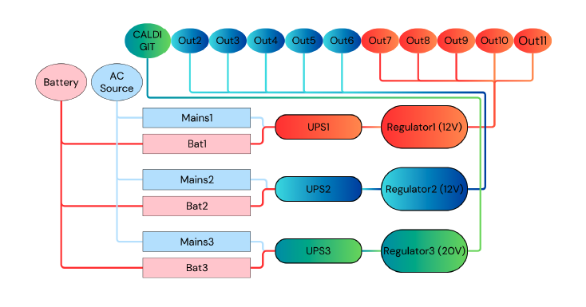
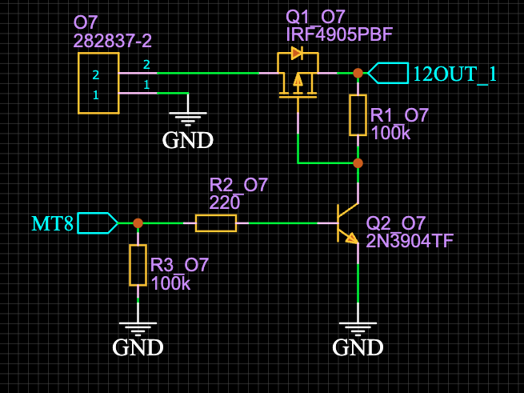
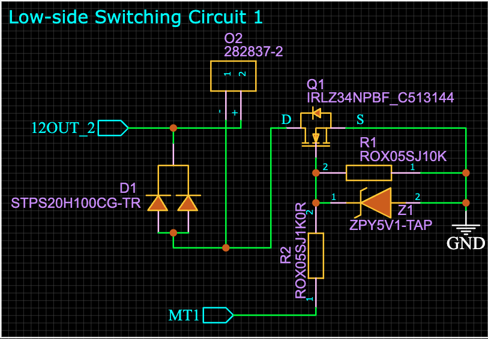
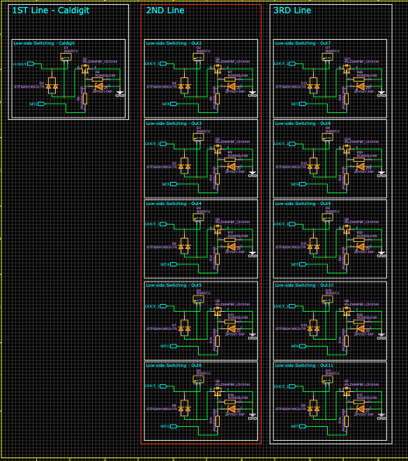
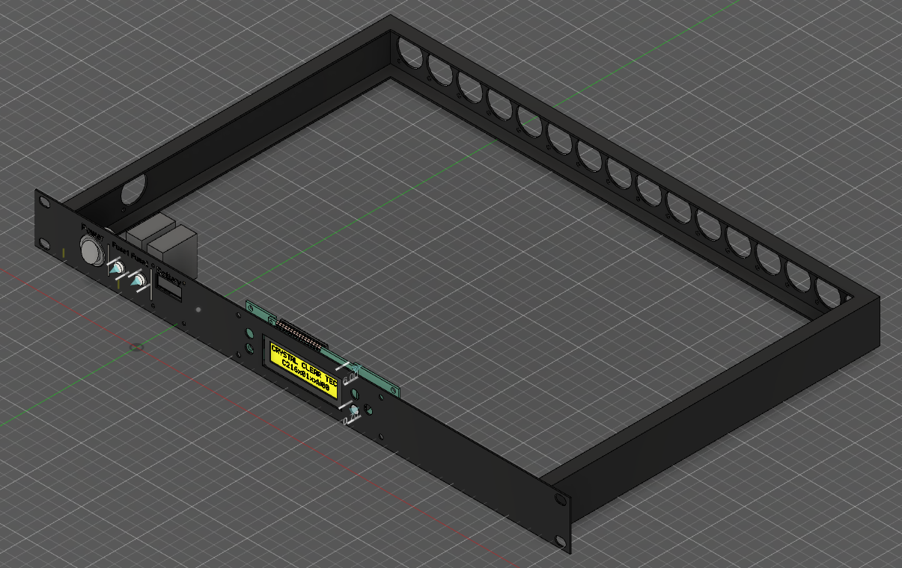
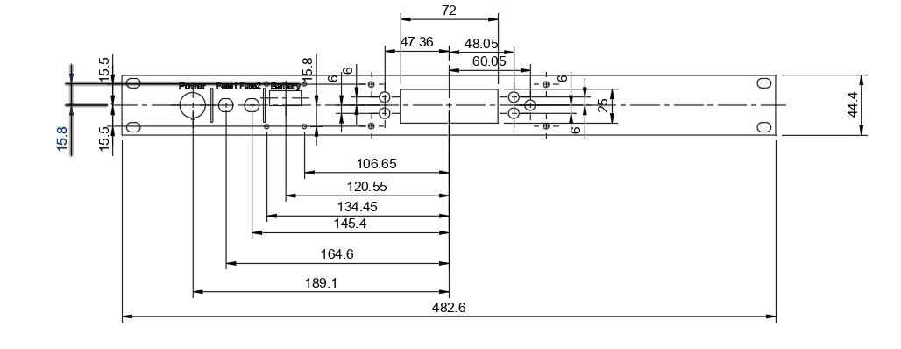
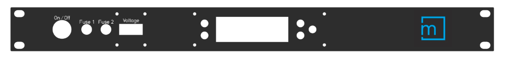
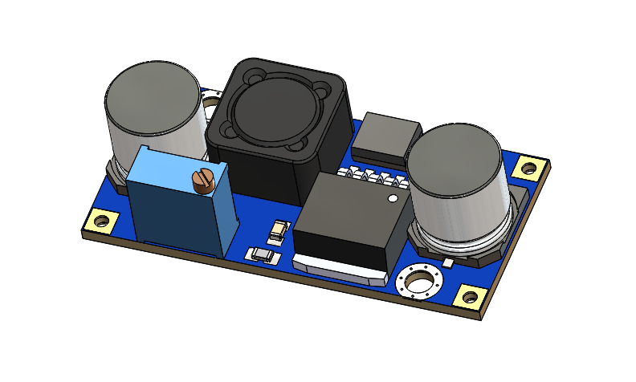

# DistroBox

## Introduction

A power distribution box project utilising dcdc buck boost converters with ratings of 6-34V for inputinput and outputs 5-24V and High current, up to 15A. UPS modules are involved in the power distribution project as well. Each UPS has maximum current of 10A load and 12V for each input. the UPS (uninterruptible power supply) keeps a seamless connectivity of the output given that one of the inputs are unplugged or in our case, the battery ran out.

This is a project that already existed and was designed by other engineers in the company, Mission Digital.

The idea behind the project was to basically have input that gets distributed to 12 outputs with seamless connectivity and regulated voltages.

The PCB is designed in 4 sheets that involves controlling FETs and BJTs by two Arduinos that communicate via the I2C protocol (involving two lines, SDA and SCL) the Arduinos are also controlling the control board ( 6 buttons ) LCD and optocouplers that control Relays that opens up the power lines (which are three).

  

The major adjustment that was done by me was to change the switching in the distribution box.

The previous Engineer used High-side switching using PMOS and NPN to trigger the PMOS' gate high or low depending on switching on and off.

  

I on the other hand was curious of using Low-side switching when it comes to high load and high voltage. So I have designed a Low-side circuit using NMOS, as follows:

  

Since the project has 11 outputs. This circuit was placed 11 times. 

  

After further research on the load and the kind of devices that will be used as load. It turns out that using high-side switching is safer:
| Feature           | High-Side Switching            | Low-Side Switching              |
|-------------------|-------------------------------|---------------------------------|
| **Switch Location** | Between source and load        | Between load and ground         |
| **Safety**          | Generally safer                | Less safe in grounded systems   |
| **Complexity**      | More complex                   | Simpler                         |
| **Cost**            | Potentially higher             | Lower                           |
| **Load Isolation**  | Higher                         | Lower                           |

The cost may be lower but in our system High side switching would be better. So we will stick with the high-side.

Conclusion: the high-side switching and the low-side switching was a learning experience and I am glad I been through.

The second section that I had done was to design on 3D CAD the Front panel as the hardware case will need to be manufactured.

The following is what the previous engineer had done. Great job :D

  

From that 3D design I had isolated the front panel to take the dimensions to design the 3D model of the front panel so they can drill through it.

  

  

Where the LCD with the control buttons (5 buttons) that gives the input to the Arduinos are in the middle. and on the left two main fuses for the power input of 20A each.

Further adjustments were done to the project as the previous engineer used Parallel LDOs to regulate the input voltages from either source (mains or battery) to 5V. After research, paralleling LDOs is a red flag as the dominant LDO would overload and overheat and that would shorten its lifespan and maybe results to failure. This because the LDO with the highest output (even tiny difference matters) will be always be the dominant one.

On the other hand, I have chosen a specific dcdc converter with very good heat-sinking and more reliability. I have chosen the LM2596 buck converter which is capable of driving a 3.0A load with excellent line and load regulation.

  

The previous is later to be implemented in the project in the future.

